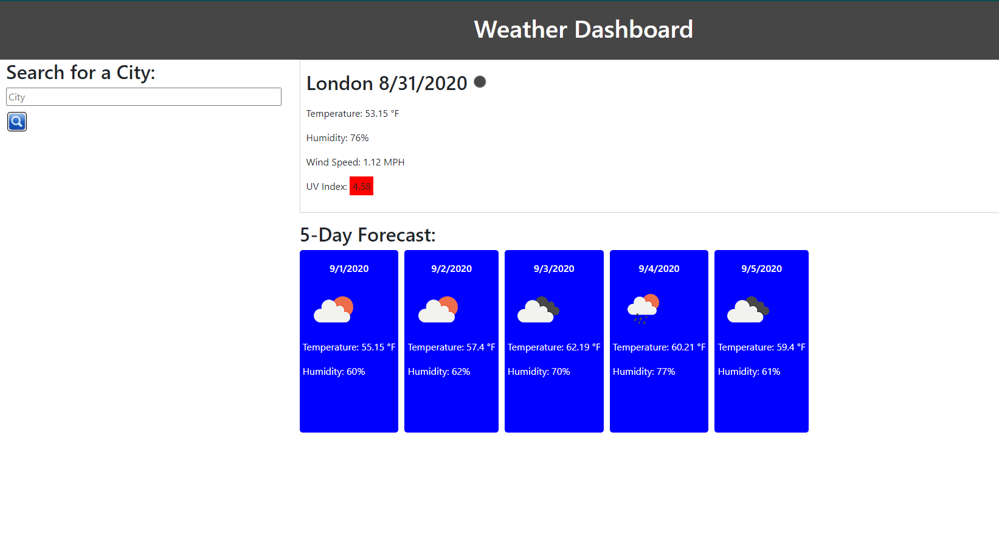

# weather-dashboard
## Purpose
A weather dashboard that displays the current weather forecast and five day forecast of a city. User can enter city to display forecast for that city. Search histories are stored in Local Storage and displayed on the dashboard. 

## Built With
* HTML
* CSS
* Javascript
* Bootstrap
* Moment.js
* Open weather API

## Website
https://hameed1239.github.io/weather-dashboard/

Format: ![Alt Text] (url)
## Contribution
Made by Hameed Kazeem

### ©️2020 Hameed Kazeem, Inc 